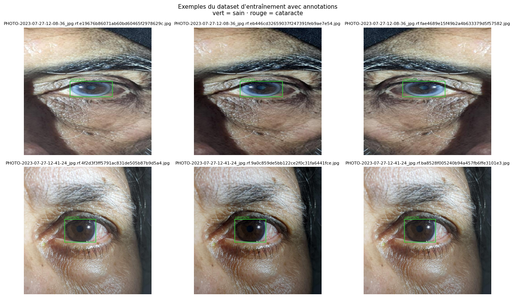
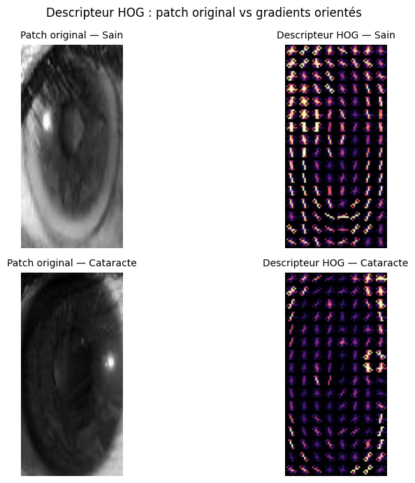
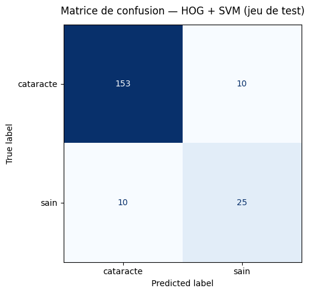
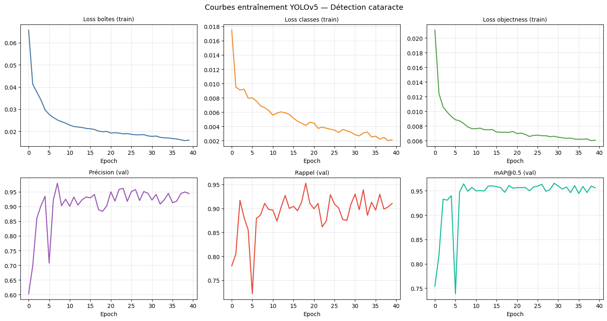
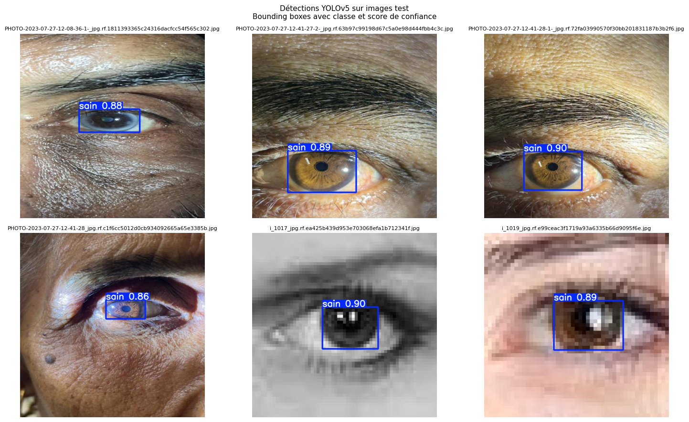
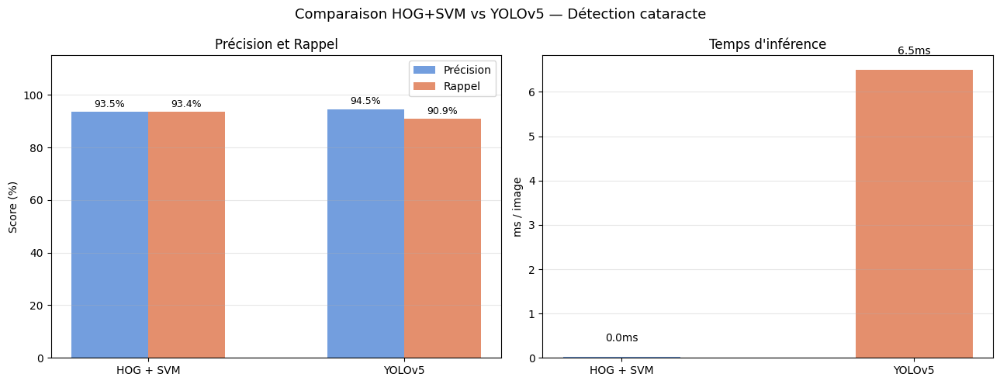

# Eye Cataract Detection — HOG+SVM vs YOLOv5

**Two approaches to detecting cataracts from eye images — classical features vs deep learning**
*Mini-project · Biomedical Video Analysis · Master BIAM 2025–2026 · FSDM*

> 🇫🇷 [Readme en français](README.fr.md)

---

Non-invasive cataract screening from eye photographs: given an eye image, detect the eye region and classify it as **healthy (sain)** or **cataract**, using two complementary pipelines trained on the same dataset.

## Dataset

[cataract-eye-detection v2 (Roboflow)](https://universe.roboflow.com/jaouads-workspace/cataract-eye-detection) — YOLO format, 2 classes (`sain` / `cataracte`), train/valid/test splits.



## Method 1 — HOG + SVM (classical)

Extract 64×128 patches from the YOLO annotations → Histogram of Oriented Gradients (3780-d) → StandardScaler + LinearSVC.

The intuition is visible in the descriptor itself: a healthy eye produces strong, well-aligned gradients; a clouded cataract lens washes them out.



| Metric | Value |
|---|---|
| Accuracy (test) | **89.90%** |
| Precision / Recall (weighted) | 89.90% / 89.90% |
| F1 (weighted / macro) | 0.899 / 0.827 |
| Sensibility / Specificity | 71.4% / 93.9% |
| Training time | **4.9 s** (CPU) |
| Inference | **0.03 ms/image** |

Confusion matrix (198 test patches): TP 153 · FN 10 · FP 10 · TN 25



## Method 2 — YOLOv5 (deep learning)

Fine-tuned `yolov5s.pt` (COCO transfer learning) on the full images, 50 epochs, batch 16, T4 GPU, early stopping at epoch 29.



| Metric | Value |
|---|---|
| mAP@0.5 | **96.55%** |
| mAP@0.5:0.95 | 80.26% |
| Precision (best epoch) | 94.50% |
| Recall (best epoch) | 90.89% |
| Training time | 52.5 min (GPU T4) |
| Inference | ~6.5 ms/image |



## Head-to-head



| | HOG + SVM | YOLOv5 |
|---|---|---|
| Precision | 93.53% | **94.50%** |
| Recall | 93.43% | 90.89% |
| Extra metrics | F1 0.935 | mAP@0.5 96.6% |
| Training | **52 s** (CPU) | 52 min (GPU) |
| Interpretability | ✅ visualizable descriptor | ❌ black box |
| Confidence score per box | ❌ | ✅ native |

**Conclusion:** for a clinical video-rate screening system, YOLOv5 is the recommended method — higher precision, real-time inference (~150 FPS), and per-box confidence useful to a practitioner. HOG+SVM remains an excellent interpretable baseline that trains in seconds without a GPU.

## Notebooks (executed, results embedded)

| Notebook | Description |
|---|---|
| [`notebooks/hog-svm-cataract-roboflow.ipynb`](notebooks/hog-svm-cataract-roboflow.ipynb) | Full classical pipeline: patches → HOG → SVM → evaluation |
| [`notebooks/yolo-cataract-detection.ipynb`](notebooks/yolo-cataract-detection.ipynb) | YOLOv5 fine-tuning + evaluation + comparison |

Also viewable on Kaggle:
- [hog_svm_cataract_roboflow](https://www.kaggle.com/code/jaouadelmorabit/hog-svm-cataract-roboflow)
- [yolo_cataract_detection](https://www.kaggle.com/code/jaouadelmorabit/yolo-cataract-detection)

## Reproduce

```bash
pip install roboflow scikit-image scikit-learn opencv-python matplotlib
jupyter notebook notebooks/hog-svm-cataract-roboflow.ipynb   # CPU-friendly
```

The YOLO notebook expects a Kaggle/Colab GPU runtime and clones ultralytics/yolov5 itself.
Set your Roboflow API key via Kaggle Secrets (`ROBOFLOW_API_KEY`) — never hardcode it.

## Medical disclaimer

Research/educational project — **not a medical device**, not for clinical decision-making.

## Author

**Jaouad El Morabit** — Master BIAM 2025–2026, Biomedical Imaging
More: [video-object-tracking-portfolio](https://github.com/jawadelMorabit-smi/video-object-tracking-portfolio) · [radiogenomics-analytics-framework](https://github.com/jawadelMorabit-smi/radiogenomics-analytics-framework)
